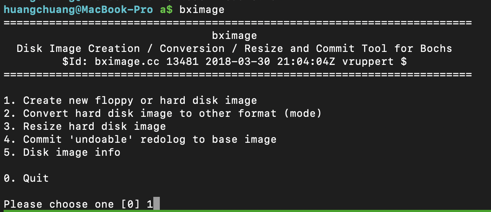
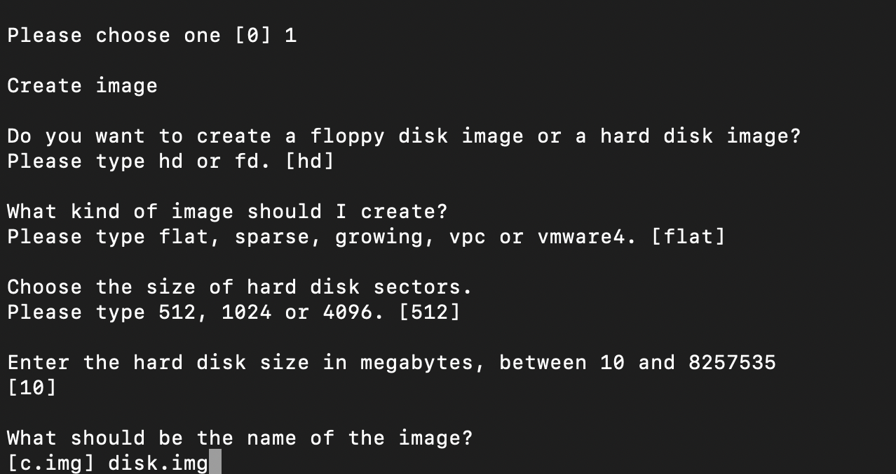
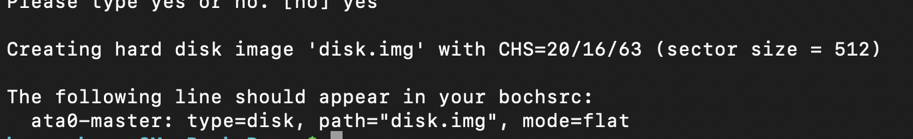
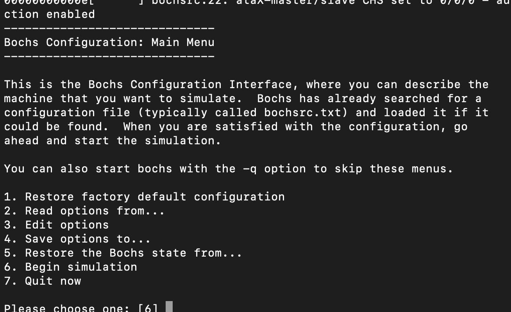
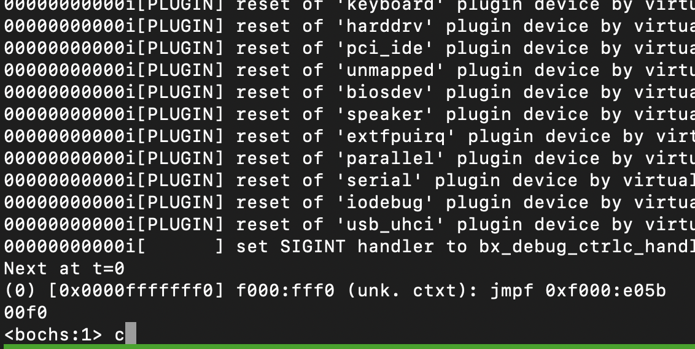
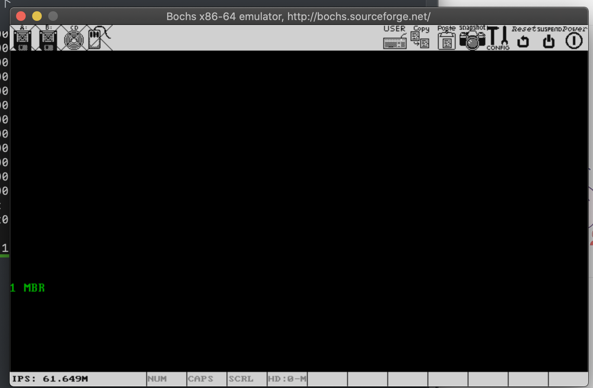

# 主要内容

编译一个主引导记录，写到磁盘的第一个扇区，然后用bochs启动，显示字符串1 MBR

# 操作步骤

1、使用bximage 工具创建一个磁盘

然后回车，disk就创建出来了

把上图中的ata0这一行写到bochsrc文件中，当然了这个我们已经写过了

2、执行mbr,sh文件

3、执行bochs -f bochsrc, 结果如下

回车，如下

结果如下

本章结束
